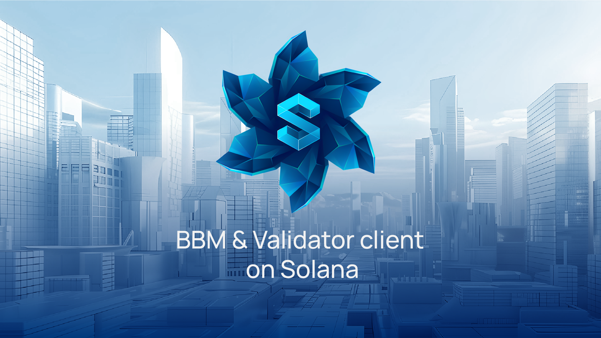
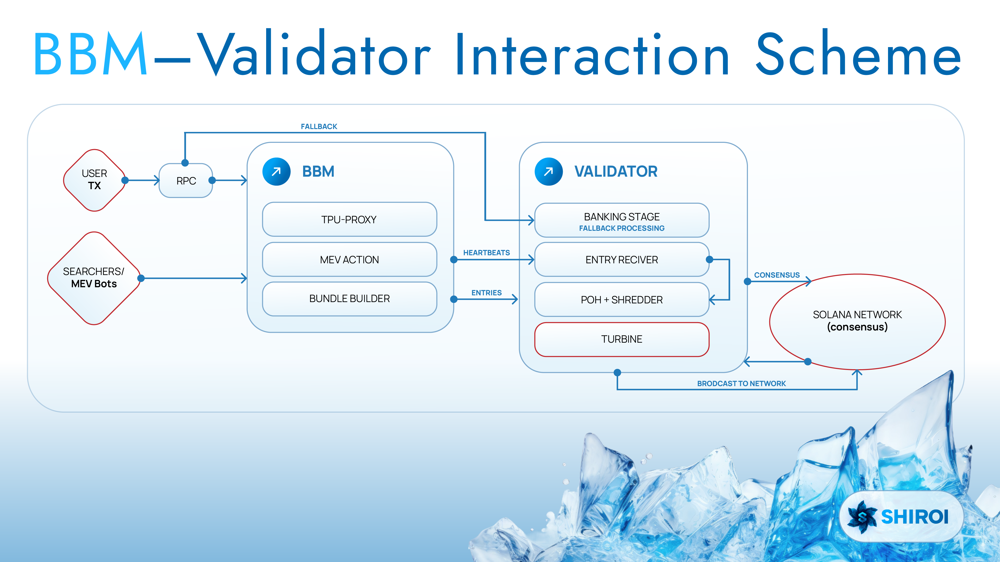

# Shiroi
BBM (block builder) and validator client for Solana  
⚠️ Attention!
This repository is created solely to provide all required information within the README.md.
The main repository with the validator client is located here — https://github.com/shiroi-labs/bbm-agave

# Submission to 2025 Solana Colosseum Submission by:
- Semyon Golovin. Founder. [GitHub](https://github.com/semgoSE). [TG](https://t.me/semgoSE). [X](https://x.com/semgoSE).
- Evgeny Malogritsenko. Project manager. [GitHub](https://github.com/Noname400). [TG](https://t.me/nonexhunt). [X](https://x.com/DevnpSol).
- Semen Golovchenko. Backend Dev. [GitHub](https://github.com/iFrosta). [TG](https://t.me/ifrosta). [X](https://x.com/ifrosta).
- Khramtsovskii Igor. Community manager. [TG](https://t.me/hagtyf). [X](https://x.com/YmkaAvadol)
- Maxim Afanasyev. Ceo. [TG](https://t.me/maxnutrition). [X](https://x.com/_Marakaya)

# Resources
- [BBM Promotion video](https://youtube.com) (watch it first, it's amazing!)
- Shiroi validator repository link - https://github.com/shiroi-labs/bbm-agave
- [Video of the technical presentation]()
- [Pitch Deck video]()
- [Documentation](https://docs.shiroi.io)
- [Official website](https://shiroi.io)
- [X (former Twitter)](https://x.com/shiroi_sol)
- [Telegram](https://t.me/shiroi_sol)

# Problem and solution
1. High latency:  
- RPC → TPU → Banking Stage causes 300–500 ms delay and missed arbitrage.  
- BBM: Direct Trader → BBM with pre-simulation cuts latency to 50–100 ms.  
2. Inefficient block assembly: 
- Validators fill blocks only 70–80 %, wasting compute on conflicts.  
- BBM: Parallel processing, conflict resolution, optimized bundles.  
3. Limited transaction logic: 
 - Solana lacks conditional execution and privacy.  
 - BBM: Adds conditional and atomic bundles with concealed content.  
4. App-controlled execution:
- Validators dictate order, enabling MEV.
- BBM: Lets apps set their own auction logic and fair ordering.

# SUMMARY OF SUBMISSION FEATURES

**Core Services**
 - Block Builder Module (BBM)  
An external optimization layer for block construction with MEV auctions and pre-execution.

 - Modified Agave Validator Client  
A fork of the native validator client integrating BBM via gRPC, heartbeats, and entries stream.

 - Automatic Fallback System  
Instant switch to standard mode when BBM is unavailable — zero downtime.

**MEV Infrastructure**  
 - MEV Auction Platform  
Sealed-bid auctions for arbitrage, liquidations, and sniping with fair ordering.

 - Bundle Builder Engine  
Pre-execution, conflict detection, and intelligent transaction ordering with 95%+ block fill rate.

 - TPU-PROXY  
Parallel transaction intake for low-latency processing (50–100 ms vs 300–500 ms).

 - Custom Transaction Scheduler  
Programmable ordering logic with plugin support.

# Tech Stack
Rust: BBM, fork Anza validator client.
SDK: standart SDK Solana, custom library Shiroi labs.

# Architecture

# Quick start
- To test our client, you can either clone our repository (https://github.com/shiroi-labs/bbm-agave) to your own server, build and run it and add on service file:  
`--block-builder-url http://66.45.234.138:11221 \`  
`--tpu-proxy-url http://66.45.234.138:11222`
- Or request access to a live testnet server already running our client (text to Evgeny on [Telegram](https://t.me/nonexhunt))
